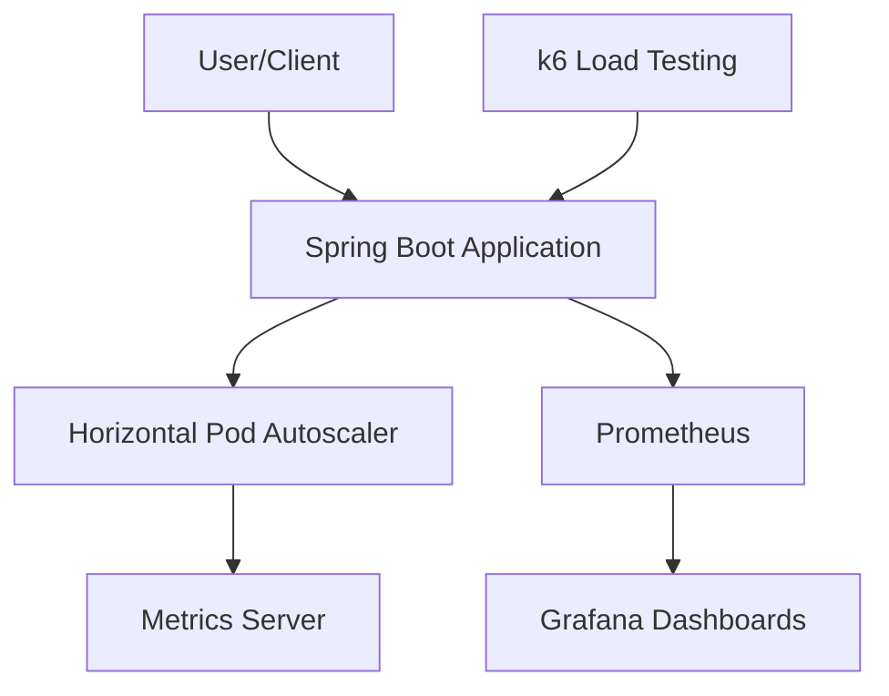

# System Patterns: Kubernetes Autoscaling Demo

## System Architecture
The autoscaling demo consists of several interconnected components:

1. **Spring Boot Application**: Core application with endpoints to generate CPU and memory load
2. **Kubernetes HPA**: Monitors resource usage and scales the application pods
3. **Metrics Server**: Collects resource metrics from nodes and pods
4. **Prometheus**: Stores time-series metrics data
5. **Grafana**: Visualizes metrics and scaling events
6. **k6**: Generates load to trigger autoscaling

## Key Technical Decisions

### 1. Kind for Local Kubernetes
Using Kind (Kubernetes in Docker) provides a lightweight, local Kubernetes environment that closely mimics a production cluster while being easy to set up and tear down.

### 2. Spring Boot for Demo Application
Spring Boot was chosen for its:
- Built-in actuator endpoints for health checks
- Prometheus integration for metrics
- Ease of creating REST endpoints
- Widespread adoption in enterprise environments

### 3. CPU and Memory Load Generation
The application includes custom endpoints to generate:
- CPU load through prime factorization calculations
- Memory load through controlled memory allocation
This allows for precise control over resource usage patterns.

### 4. HPA Configuration
The HPA is configured to:
- Scale based on CPU utilization (70% threshold)
- Scale from 1 to 10 pods
- Use custom stabilization windows for demo purposes (faster than production defaults)

### 5. Monitoring Stack
Prometheus and Grafana provide:
- Real-time visibility into resource usage
- Historical data for analysis
- Visual representation of scaling events

## Design Patterns

### 1. Microservice Architecture
The application is designed as a self-contained microservice with:
- Clear API boundaries
- Independent scaling
- Containerized deployment

### 2. Resource-Based Scaling
The demo implements horizontal scaling based on resource metrics rather than custom metrics, showcasing the most common autoscaling pattern.

### 3. Controlled Load Generation
The application uses parameterized endpoints to generate predictable load patterns, allowing for demonstration of specific scaling scenarios.

### 4. Infrastructure as Code
All components are defined declaratively in YAML files, enabling reproducible deployments and clear documentation of the infrastructure.

### 5. Graceful Shutdown
The application implements a graceful shutdown pattern to ensure clean termination when Kubernetes stops pods:
- Spring Boot's built-in graceful shutdown support is enabled
- Application listens for SIGTERM signals from Kubernetes
- Long-running operations check for shutdown signals and terminate cleanly
- Resources are released properly during shutdown
- Kubernetes is configured with an appropriate termination grace period

## Component Relationships
- The Spring Boot application exposes metrics that are collected by Prometheus
- The Metrics Server provides resource usage data to the HPA
- The HPA controls the number of application pods based on the metrics
- Grafana visualizes the metrics and scaling events
- k6 generates load against the application to trigger scaling events
